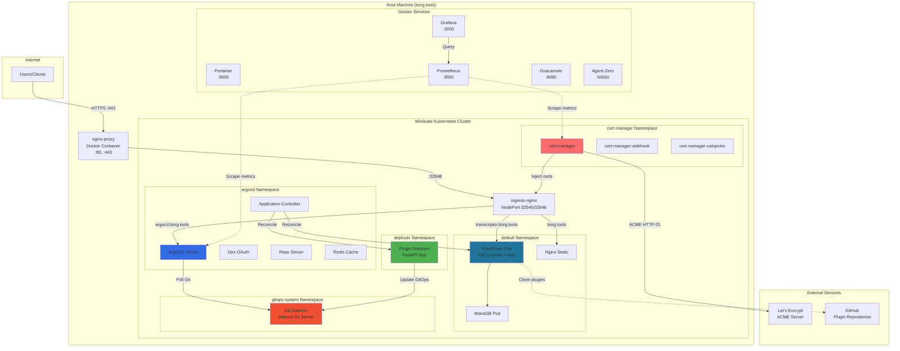
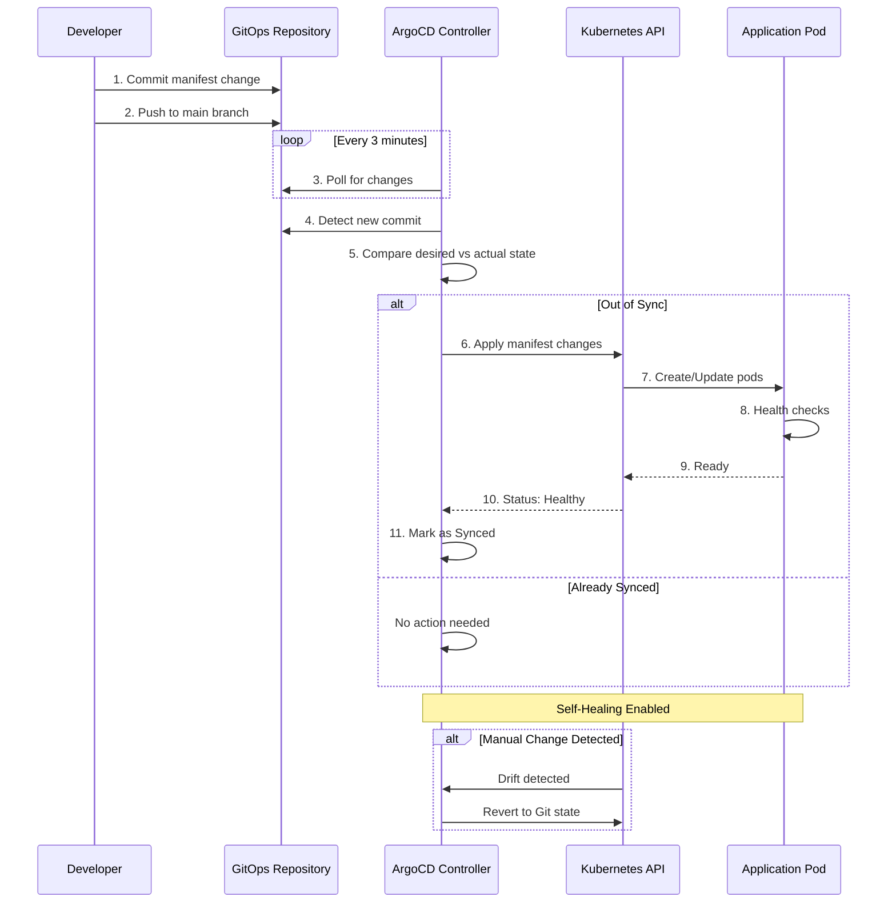
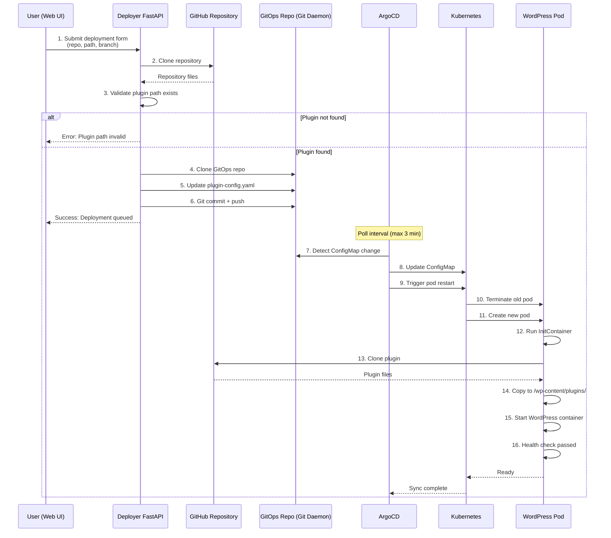
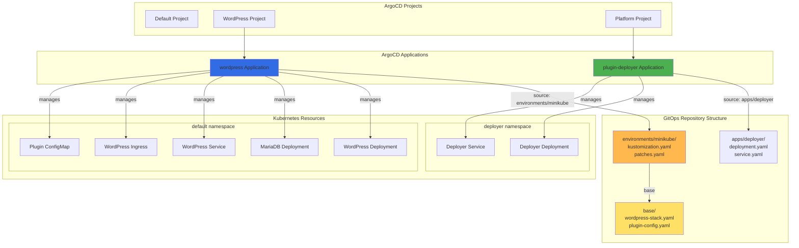
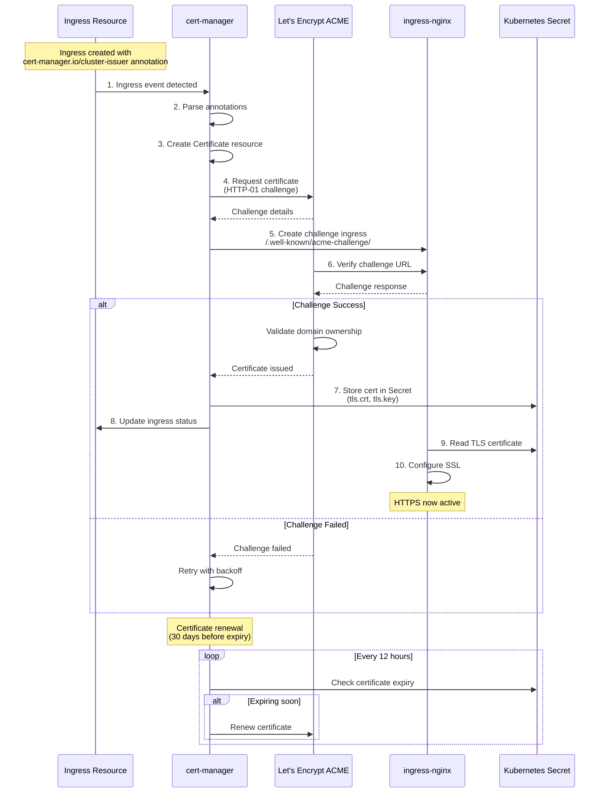
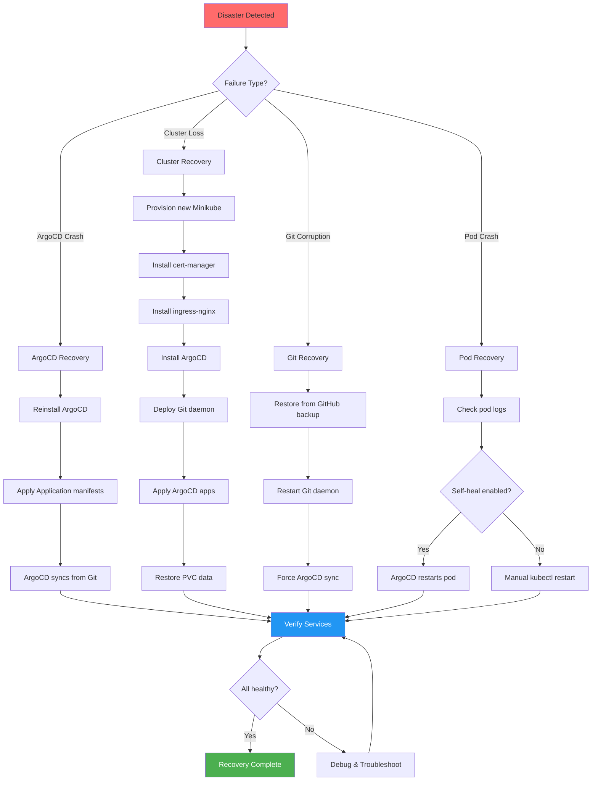
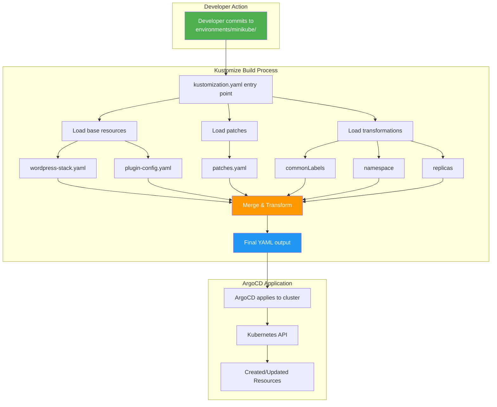
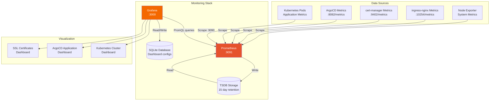
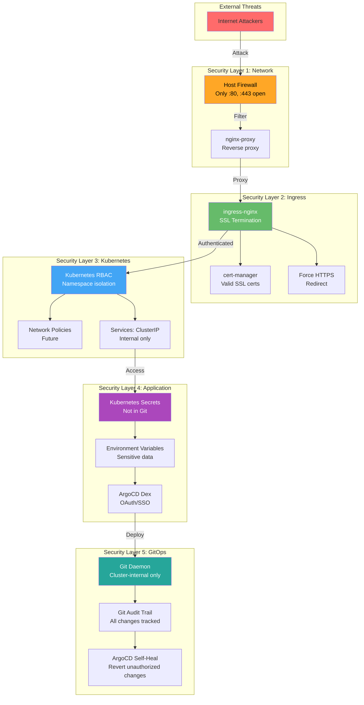

# GitOps Architecture Diagrams

This document contains visual diagrams of the GitOps infrastructure using Mermaid diagram syntax.

---

## 1. Infrastructure Architecture Overview

---

## 2. GitOps Deployment Flow

---

## 3. Plugin Deployment Workflow

---

## 4. ArgoCD Application Hierarchy

---

## 5. SSL Certificate Automation Flow

---

## 6. Network Traffic Flow

```mermaid
graph LR
    subgraph "Internet"
        Client[Web Client]
    end

    subgraph "Host Network (borg.tools)"
        HostIP[Public IP<br/>borg.tools]
        NginxProxy[nginx-proxy<br/>:80, :443]
    end

    subgraph "Minikube VM"
        MinikubeIP[Minikube IP<br/>192.168.49.2]

        subgraph "NodePort Services"
            NodePort80[NodePort :32546<br/>HTTP]
            NodePort443[NodePort :32648<br/>HTTPS]
        end

        subgraph "ingress-nginx"
            IngressCtrl[Ingress Controller<br/>Service: ClusterIP]
            IngressPod[Ingress Pod<br/>nginx process]
        end

        subgraph "Services"
            ArgoService[argocd-server<br/>ClusterIP :80]
            WPService[wordpress<br/>ClusterIP :80]
            NginxService[nginx-service<br/>ClusterIP :80]
        end

        subgraph "Pods"
            ArgoPod[argocd-server Pod<br/>:8080]
            WPPod[wordpress Pod<br/>:80]
            NginxPod[nginx Pod<br/>:80]
        end
    end

    Client -->|1. HTTPS :443| HostIP
    HostIP --> NginxProxy
    NginxProxy -->|2. Forward :443| MinikubeIP
    MinikubeIP --> NodePort443
    NodePort443 -->|3. Route| IngressCtrl
    IngressCtrl --> IngressPod

    IngressPod -->|4. Host: argocd.borg.tools| ArgoService
    IngressPod -->|4. Host: transcriptor.borg.tools| WPService
    IngressPod -->|4. Host: borg.tools| NginxService

    ArgoService -->|5. Proxy| ArgoPod
    WPService -->|5. Proxy| WPPod
    NginxService -->|5. Proxy| NginxPod

    style Client fill:#E8F5E9
    style NginxProxy fill:#FFF3E0
    style IngressPod fill:#E3F2FD
    style ArgoPod fill:#326CE5,color:#fff
    style WPPod fill:#21759B,color:#fff
```

---

## 7. Disaster Recovery Flow

---

## 8. Kustomize Build Process

---

## 9. Monitoring Architecture

---

## 10. Security Layers

---

## Usage Notes

### Viewing These Diagrams

**GitHub/GitLab**: Mermaid diagrams render automatically in markdown files.

**VS Code**: Install "Markdown Preview Mermaid Support" extension.

**Online**: Copy-paste to https://mermaid.live/ for interactive editing.

**Export**: Use Mermaid CLI or online tools to export as PNG/SVG.

### Diagram Types Used

- **Graph TB/LR**: Top-to-Bottom or Left-to-Right flowcharts
- **Sequence Diagram**: Time-based interaction flows
- **Subgraphs**: Logical groupings (namespaces, services)

### Customization

Feel free to:
- Modify colors (fill, color properties)
- Add/remove components
- Adjust layout (TB, LR, RL, BT)
- Export for presentations

---

**Last Updated**: October 2025
**Created By**: Wojciech Wiesner
**Part Of**: GitOps Portfolio Documentation
